# AmaraVisa CRM — Team guide

A short guide for consultants and admins. Use this to find the right screen and know what to do there.

---

## How the sidebar works

The left menu is grouped by job, not by page name.

- Click a **group name** (Insights, Cases, People…) to open or close its screens.
- Several groups can stay open at the same time.
- **Admin** appears only if you are an admin.
- Consultants see **My tasks**; admins see **Tasks** (all staff).
- Use the **search** box at the top to find a case, customer, or lead quickly.
- The **bell** shows notifications.
- Your **name** at the bottom of the sidebar opens Profile and Sign out.

---

## Menu map

```mermaid
flowchart TB
  Insights --> Dashboard
  Insights --> CaseReports
  Insights --> PaymentReports
  Insights --> LeadAnalytics
  Cases --> Pipeline
  Cases --> ClosedCases
  Cases --> OfflineCase
  Cases --> Tasks
  People --> Leads
  People --> Clients
  People --> FollowUps
  Operations --> ServiceOrders
  Operations --> Finance
  Operations --> Inbox
  ClientCare --> PassportExpiry
  ClientCare --> Birthdays
  Admin --> VisaProducts
  Admin --> PassportProducts
  Admin --> DocumentMaster
  Admin --> FieldMaster
  Admin --> Consultants
  Admin --> CaseNumbers
```

---

## Everyday work path

**New inquiry (phone, walk-in, WhatsApp)**  
People → **Leads** → log **Follow-ups** → convert when ready → **Pipeline** (visa/passport) or **Service orders** (hotel, tickets, etc.) → **Finance** for invoice and payment.

**Customer already applied on the portal**  
The case appears in **Pipeline**. Open it, check documents, move stages, add tasks.

**Walk-in with no portal login**  
Cases → **New offline case** → then work it in **Pipeline**.

**Start of day**  
**Dashboard** (warnings and SLA) → **Follow-ups** (today / overdue) → **Passport expiry** and **Birthdays** for outreach.

---

## Insights

### Dashboard

Operations overview: counts, warnings, SLA health, and team performance.

**Use when:** you start the day, or you need a snapshot of what is stuck (overdue SLA, docs in review, unpaid).

### Case reports

Case volume, stages, SLA, and funnel over a date range.

**Use when:** you need numbers for a review, not day-to-day case work.

### Payment reports

Collections and outstanding invoices.

**Use when:** you are checking money in vs money due, by period or consultant.

### Lead analytics

Lead sources, conversion, and follow-up performance.

**Use when:** you want to see which sources convert and where follow-ups slip.

---

## Cases

### Pipeline

Active visa and passport cases on a board (or list). Drag a card to change stage, or open a case for documents, notes, and decision.

**Typical stages:** New → Docs pending → Ready → Submitted → Decision.

**Use when:** this is the main screen for live applications.

### Closed cases

Archive of applications that already have a decision.

**Use when:** you need history, not active work.

### New offline case

Create a case yourself when the customer did not apply through the website.

**Use when:** walk-in, phone booking, or any case that should skip the customer portal checkout.

### Tasks / My tasks

To-dos linked to cases (call client, chase documents, follow up embassy).

- Consultants: **My tasks** — only yours.
- Admins: **Tasks** — everyone’s.

**Use when:** you need a checklist, not the full case board.

---

## People

### Leads

Capture inquiries and move them through status. Changing status usually needs a follow-up result. Convert a lead when they are ready to become a case or a service order.

**Use when:** someone is not yet a paying / filed application.

### Clients

All contacts, ranked by how much work they have (cases, orders, travelers). Open a row for the full history.

**Use when:** you need the person, not a single case — family travelers, past work, payments.

### Follow-ups

Today, overdue, and logged call/WhatsApp results across all service types.

**Use when:** you are doing outbound follow-up, not browsing the lead board.

---

## Operations

### Service orders

Hotel, tickets, packages, insurance, and car bookings — work that is **not** a visa/passport case.

**Use when:** the lead converted to a service, not an application file.

### Finance

Quotations, invoices, and recording payments.

**Use when:** you need to quote, bill, or mark money received.

### Inbox

Timeline of email, WhatsApp, SMS, and calls.

**Use when:** you need the conversation history for a case or lead.

---

## Client care

### Passport expiry

Travelers whose passports are expiring. See who already has an open case. Start a renewal from here.

**Use when:** proactive renewal outreach.

### Birthdays

Upcoming birthdays from customers and traveler profiles.

**Use when:** goodwill messages and relationship care.

---

## Admin (admins only)

These screens set up the CRM. Consultants do not see this group.

### Visa products

The visa catalog: countries, types, fees, required documents and form fields.

**Use when:** you add or change what customers can apply for.

### Passport products

Same idea for passport mini-cases (renewal, new, etc.).

### Document master

Reusable document types (passport copy, photo, bank statement…). Products pick from this list.

### Field master

Reusable form fields (full name, date of birth…). Products pick from this list.

### Consultants

Staff accounts, roles, countries they handle, and who reports to whom.

**Use when:** onboarding a consultant or changing coverage.

### Case numbers

Number format for **new** cases only. Existing numbers never change.

---

## Also in the CRM (not a menu group)

| Place | What it is |
|-------|------------|
| Top search | Find cases, customers, leads without opening a menu |
| Bell | Notifications (SLA, assignments, reminders) |
| Your name → Profile | Your details and password |
| Your name → Sign out | End the session |

Opening a **case** or **client** from any list takes you to a detail screen (documents, notes, history). Those screens are not extra sidebar items.

---

## Who sees what

| | Consultant | Admin |
|--|------------|-------|
| Insights, Cases, People, Operations, Client care | Yes | Yes |
| Tasks | Own tasks only (**My tasks**) | All tasks |
| Admin group (products, masters, staff, case numbers) | No | Yes |
| Team vs whole-office numbers | Own team / assigned work | Full office |

If a report looks “smaller” than you expect, you may be seeing **your team’s** work, not the whole company. Admins see everything.
