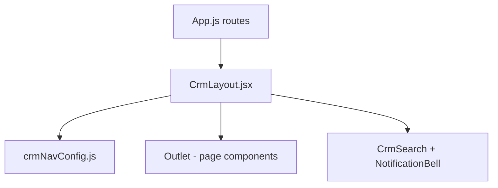

# Frontend architecture

## Monorepo layout

```
visaconsultantcrm-frontend/
├── crm/                 # Staff CRM (primary ops app)
├── customer/            # Customer portal (Next.js)
├── customer-cra/        # Legacy CRA customer (reference)
└── packages/ui/         # @passage/ui design system
```

Not a single root workspace — each package has its own `package.json` and deploy.

## Entry points

| App | Bootstrap | Router |
|-----|-----------|--------|
| CRM | `crm/src/index.js` | `crm/src/App.js` |
| Customer | `customer/src/app/layout.js` | App Router `customer/src/app/**/page.js` |

## Shared design system

**Package:** `packages/ui/`

| File | Purpose |
|------|---------|
| `tokens.js` | Editorial Luxe palette (navy/gold) |
| `theme.css` | CSS variables |
| `index.js` | Public exports |
| `components/` | Button, Card, Field, DataTable, etc. |

**Aliased as `@passage/ui` in:**
- `crm/craco.config.js`, `crm/tailwind.config.js`, `crm/src/index.css`
- `customer/next.config.mjs`, `customer/src/app/globals.css`

## CRM shell



- Layout: `crm/src/layouts/CrmLayout.jsx` — fixed sidebar, grouped nav, main scroll
- Nav config: `crm/src/layouts/crmNavConfig.js` — single source for sidebar groups

## Customer shell

- Layout: `customer/src/components/layout/customer-shell.jsx`
- Root: `customer/src/app/layout.js`

## Data fetching

| App | Pattern |
|-----|---------|
| CRM | Direct `api.get/post` in pages; React Query provider (light use) |
| Customer | React Query hooks in `customer/src/hooks/customer-api.js` |

## Local dev

```bash
cd crm && npm run dev        # http://localhost:3001
cd customer && npm run dev    # http://localhost:3000
```

Backend expected at `http://localhost:8000` (see `REACT_APP_BACKEND_URL` / `NEXT_PUBLIC_BACKEND_URL`).
