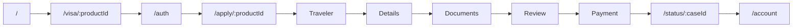
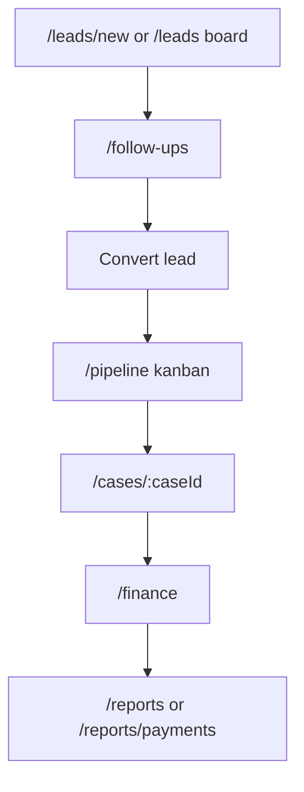
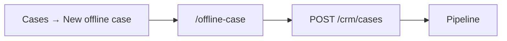
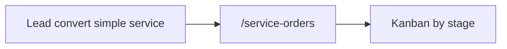
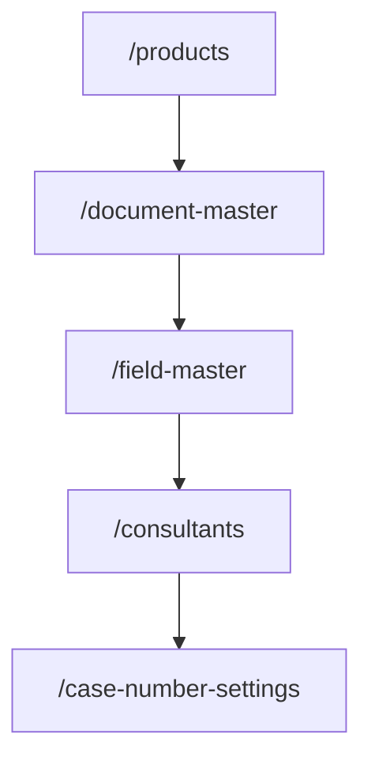

# Frontend flows

End-to-end user journeys. Backend details in backend KB `flows.md`.

## A. Customer: browse → apply → pay → track

**Key files:**
- `customer/src/app/page.js` — landing
- `customer/src/app/visa/[productId]/page.js`
- `customer/src/app/auth/page.js`
- `customer/src/app/apply/[productId]/apply-inner.js` — wizard
- `customer/src/app/status/[caseId]/page.js`

**Landing catalog filters:** sticky header `CatalogFilters`.
- **Delivery:** `DeliveryFilterSelect` — exact `processing_time_days` buckets with facet counts (`customer/src/lib/delivery-filter.js`).
- **Type:** `VisaFormatFilterSelect` — issuance `visa_format` buckets (All Visa Types, Visa Free, Visa on Arrival, e-Visa, Sticker Visa) with facet counts (`customer/src/lib/visa-format-filter.js`). Purpose `visa_type` (tourist/business/…) stays CRM/leads-only.
- **Documents:** `DocumentsProfileFilterSelect` — content buckets from required `doc_key`s / `documents_profile` (Only Passport; Passport & Bank; Passport, Bank & ITR; With US/UK/Schengen visa). Helpers: `customer/src/lib/documents-profile-filter.js`. Staff change buckets by linking required docs in Product Builder (prior-visa master: `prior_visa_us_uk_schengen`).
- Grid filter in `home-inner.js` via `matchesDelivery` + `matchesVisaFormat` + `matchesDocumentsProfile`.

Drafts: `?draft=` param, `api.get(/cases/drafts/:id)`

## B. CRM: lead → case → finance

**Key files:**
- `LeadCreate.jsx`, `Leads.jsx` — `POST /crm/leads`, convert
- `LeadFollowUps.jsx` — follow-up logging
- `Pipeline.jsx` — stage drag → `PATCH /crm/cases/:id/stage`
- `CaseDetail.jsx` — docs, tasks, decision
- `Finance.jsx` — quotations, invoices, payments

## C. Offline case (staff-initiated)

**File:** `OfflineCase.jsx`

## D. Service orders (non-visa)

**File:** `ServiceOrders.jsx` — `GET /crm/service-orders`

## E. Admin setup (enables flows)

Product builders: `ProductBuilder.jsx`, `PassportProductBuilder.jsx`

## F. Client care & comms

| Flow | Route | File |
|------|-------|------|
| Communications inbox | `/inbox` | `Inbox.jsx` |
| Passport expiry alerts | `/passport-expiry` | `PassportExpiry.jsx` |
| Birthday reminders | `/birthdays` | `Birthdays.jsx` |
| Client 360 | `/clients/:customerId` | `ClientDetail.jsx` |

## G. Insights & reporting

| Route | File |
|-------|------|
| `/` | `CrmDashboard.jsx` |
| `/reports` | `Reports.jsx` |
| `/reports/payments` | `PaymentsReport.jsx` |
| `/leads/analysis` | `LeadsAnalytics.jsx` |

Team scope banner shown when API returns `meta.scope`.
